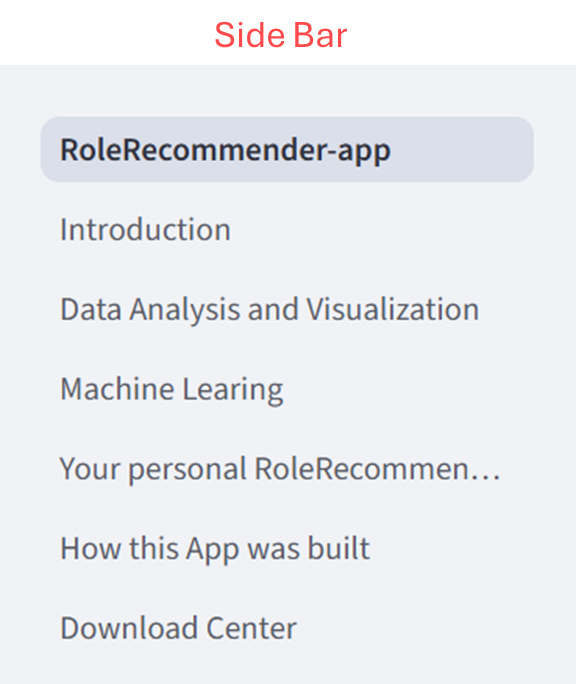
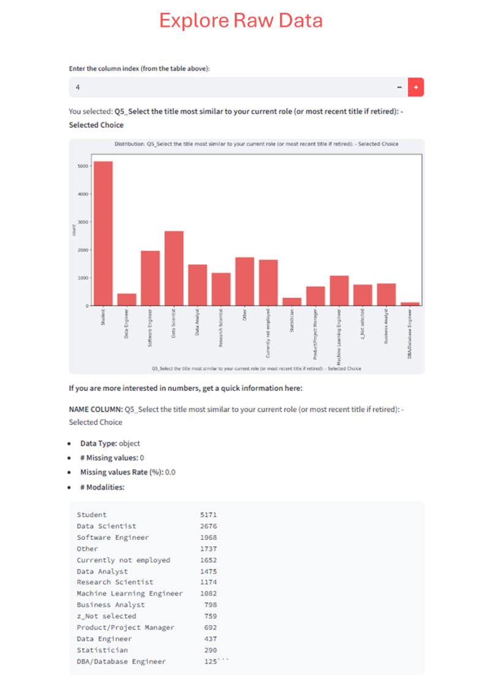
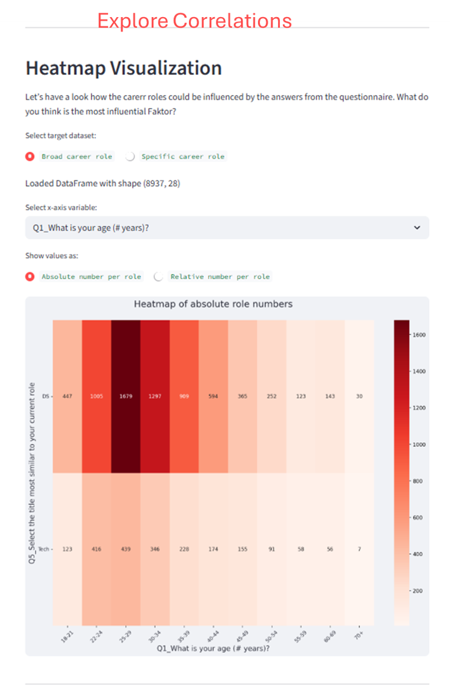
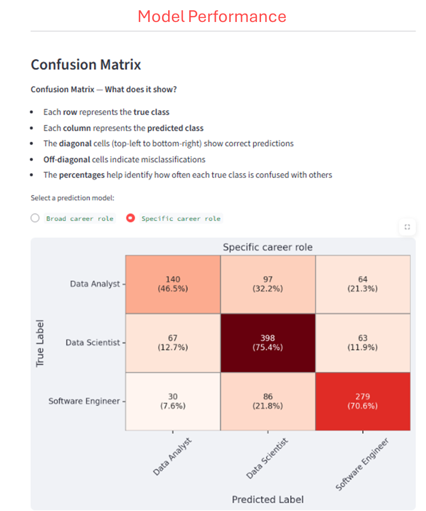
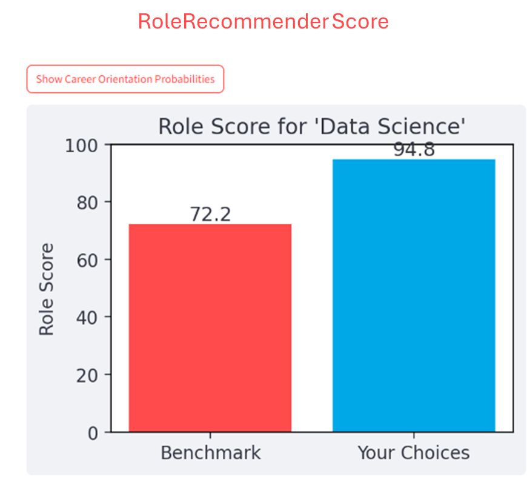
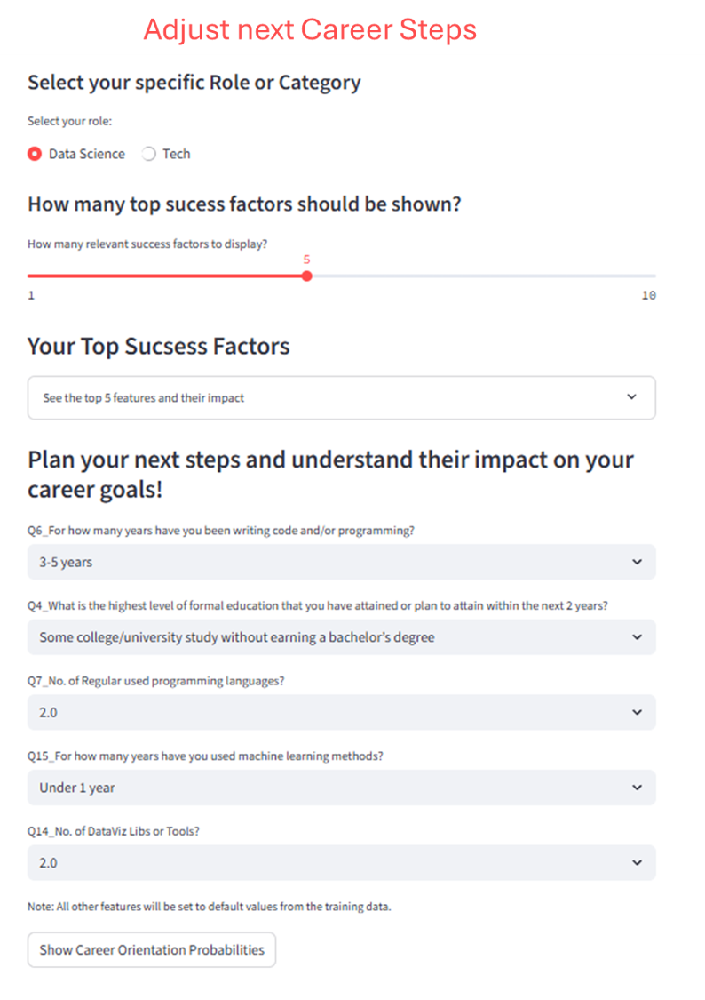
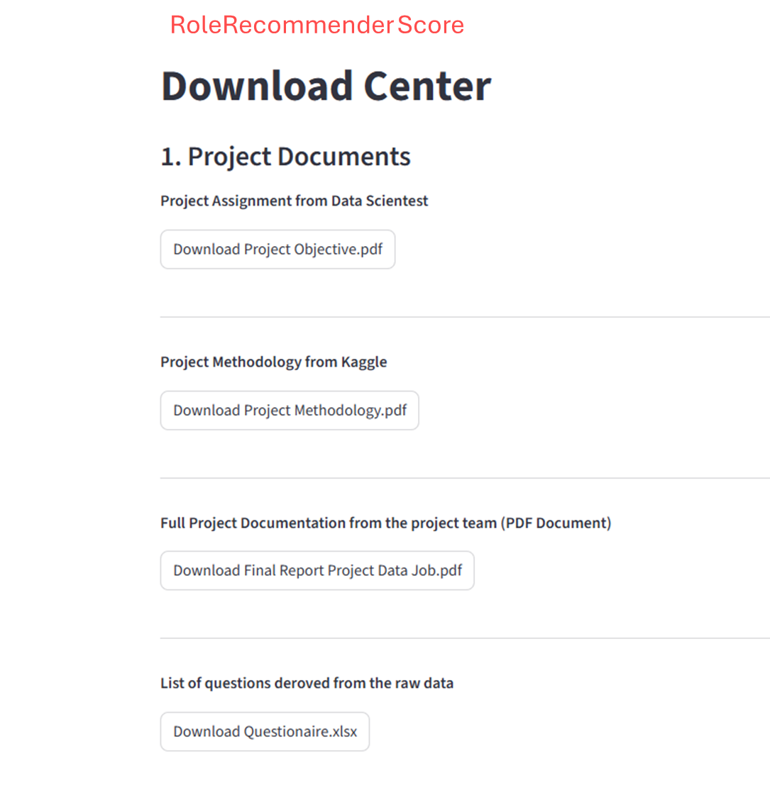

# RoleRecommender

**RoleRecommender** is a Streamlit app for recommending job roles and data science career paths based on user input.

---

## Demo

Try the app here: [RoleRecommender Online](https://w9v3uossaz4zuzqyfzufvp.streamlit.app)

---

## Features

- **Interactive UI** built with Streamlit
- **Role recommendations** for data science and tech careers
- **Visualizations** with Matplotlib and Seaborn
- **Data analysis** using Pandas and NumPy
- **Simple and intuitive** to use

---

## Directory Structure

<p align="center">
  
</p>

---

## App Pages and Functionalities

<h2 align="center">Screenshots</h2>

<p align="center">
  
  
  
</p>

<p align="center">
  
  
  
</p>

<p align="center">
  
</p>

---

## Installation

```bash
git clone https://github.com/<YOUR_USERNAME>/my_app.git
cd my_app
pip install -r requirements.txt
