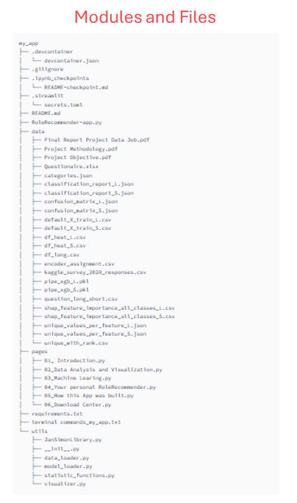

# RoleRecommender

RoleRecommender is a Streamlit app for recommending job roles and data science career paths based on user input.

## 

## Demo

You can try it out here: [RoleRecommender Online](https://w9v3uossaz4zuzqyfzufvp.streamlit.app)

## Features

* Interactive user interface with Streamlit
* Recommendations for data science roles
* Visualizations with matplotlib and seaborn
* Data analysis with pandas and numpy
* Simple and intuitive operation

## Directory structure

## App Pages and Functionalities